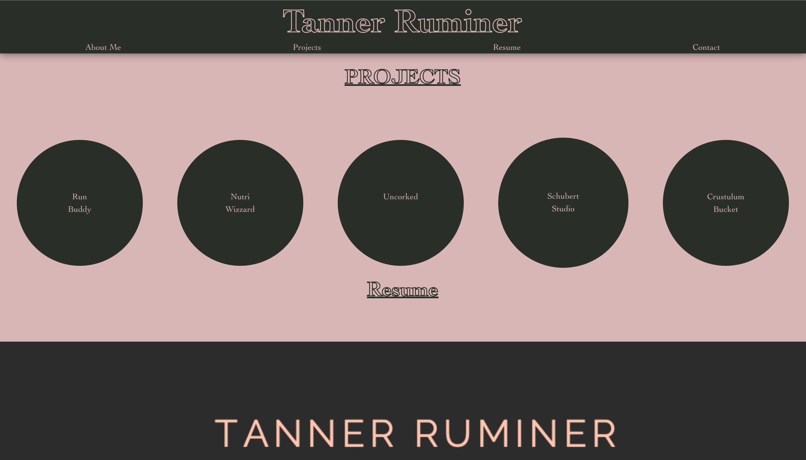

# Tanner-Portfolio

## Description

This is a portfolio webpage used to display current and past projects as well as contact information.

- To inform website users of my work
- To provide multiple forms of contact information
- To tell you a little bit about myself
- To provide potential employers a downloadable resume

## Tasks Completed

- Created a portfolio SPA using React.js
- Created a clean html page with proper commenting fot readability
- Css for cohesive styling and screen size responsiveness
- Header links to guide you to each section of the page
- Created a bio, projects, and contact and resume section
- Provided links to project that are currently live.

## Usage

To view the project follow the link attached to be taken to the live url.

- Url: [https://t-rummy.github.io/new-react-portfolio/] (https://t-rummy.github.io/new-react-portfolio/)

- Github Repository: [https://github.com/T-rummy](https://github.com/T-rummy

## Screenshot

